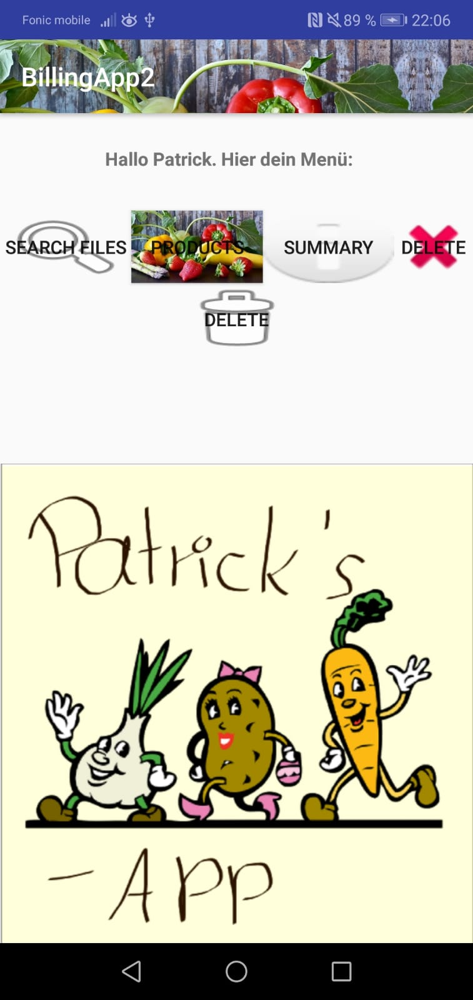

# Pos_system_2
A small app to read in CSV's with customer data, and print the bills of the orders of the Customers. You can edit and create new orders.
The printer is a small bluetoothprinter.

The app will create a folder where you can put in the orders of your customers (CSV-File)
You then can modify it and print the order of certain customers after you filtered them.
You just need a CSV with following columns:
"ID", "Menge", "Artikelname", "Menge", "Preis", "Netto Preis".

