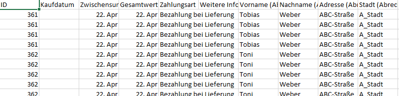
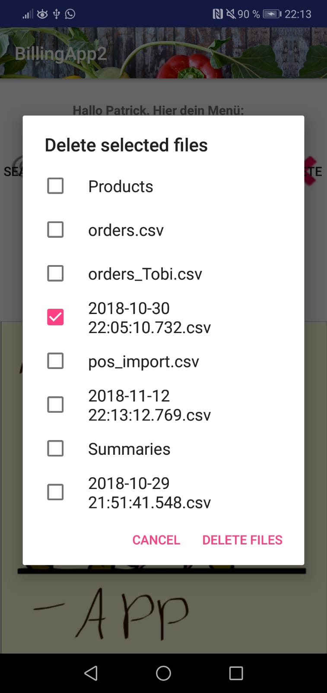
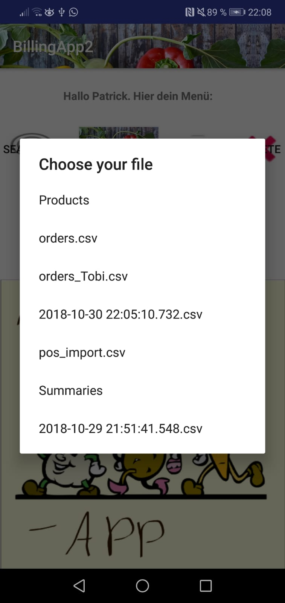
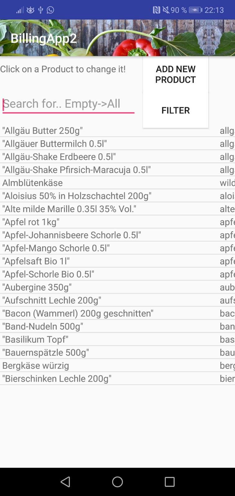
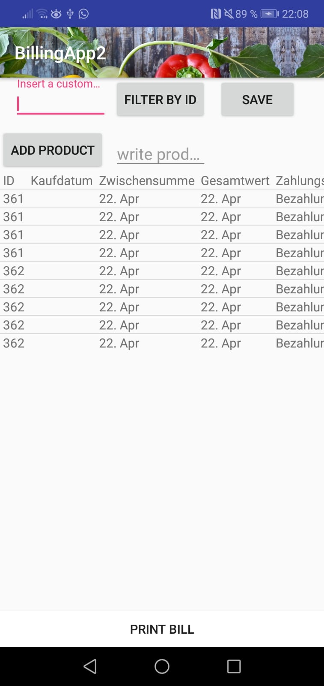
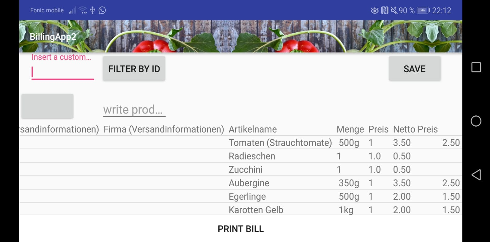
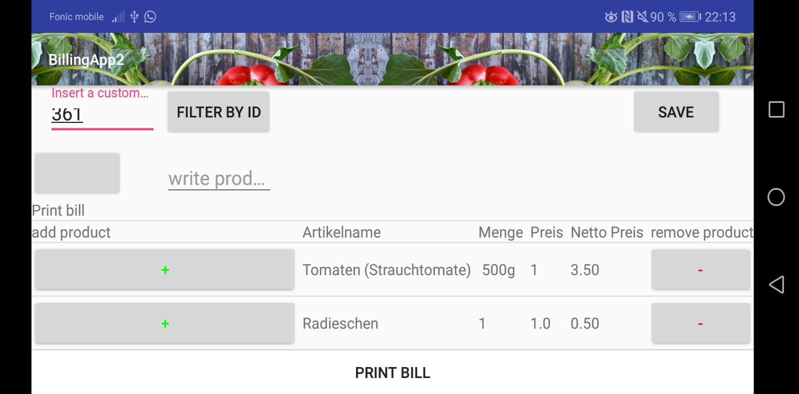

# Pos_system_2
A small app to read in CSV's with customer data, and print the bills of the orders of the Customers. You can edit and create new orders.
The printer is a small bluetoothprinter.

The app will create a folder where you can put in the orders of your customers (CSV-File)
You then can modify it and print the order of certain customers after you filtered them.
You just need a CSV with following columns:
"ID", "Menge", "Artikelname", "Menge", "Preis", "Netto Preis".

<ul align="center">
  <li> This is the home Screen  
  
   </li> 
<li> Here you see the read in orders 
  
  </li> 
<li>  Delete Files Screen  
  
  </li> 
<li> Choose a CSV   
  
  </li> 
<li>  Manage your products  
  
  </li> 
<li> CSV Read Screen  
  
  </li> 
<li> CSV Read Screen  
  
  </li> 
<li> Filter all your orders by a Customer Id/ Customer and print all its orders for that day: 
  
  </li> 

</ul>

## License

This project is licensed under the MIT License - see the [LICENSE.md](LICENSE.md) file for detail
